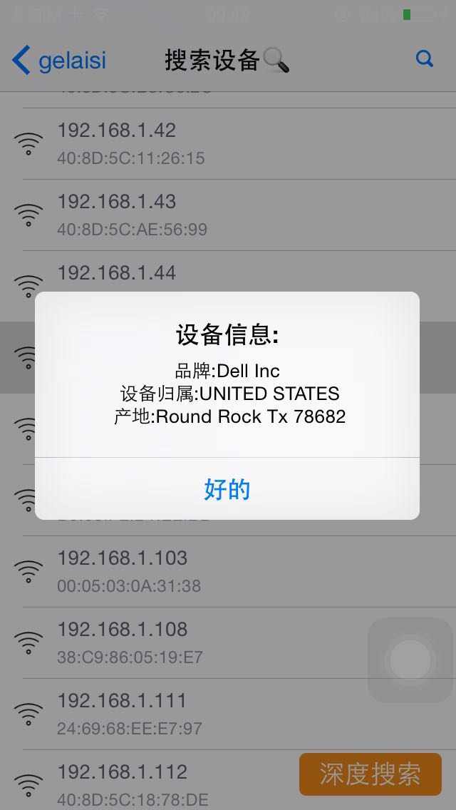

#gelaisi_wifi is a objective-c project

###The founction of the project:

	
* detect arp list(by the c code)
* detect wifi status(information)
* ping ip (for a loop to ping the wlan ip, use simplePing)
* check up the device message buy the mac address(use the api from www.macvendorlookup.com, "thanks very much")

###Demo Image:

##License

Gelaisi is open source and covered by a standard 2-clause BSD license. See the LICENSE file for more info.

Gelaisi is Free Software licensed under the GNU General Public License.

##Contact me

* tel:15913159968
* email:542136758@qq.com
* name:晓龙